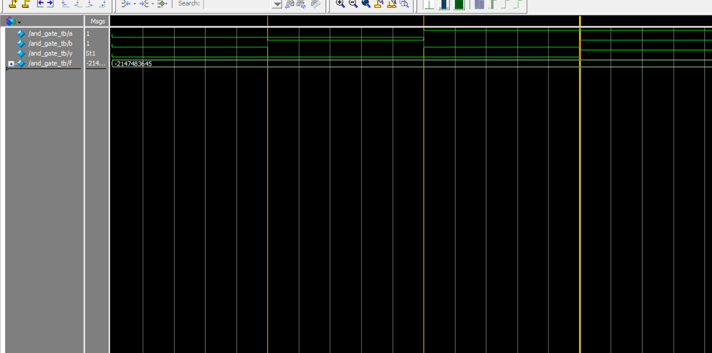

# Verilog AND Gate Project

Verilog AND Gate 模擬專案  
This is a basic project that simulates an AND gate using Verilog HDL and ModelSim.

---

## 📁 專案內容 | Project Contents

- `src/and_gate.v`：AND Gate 模組 | The AND gate module  
- `tb/and_gate_tb.v`：測試平台 | The testbench for simulation  
- `monitor_log.txt`：模擬輸出記錄 | Output log of the simulation  
- `and_gate.vcd`：波形檔 | VCD waveform file for ModelSim viewer

---

## 🛠️ 使用工具 | Tools Used

- Verilog HDL  
- ModelSim 10.5b  

---

## ▶️ 模擬步驟 (ModelSim) | Simulation Steps (ModelSim)

```shell
vlog src/and_gate.v tb/and_gate_tb.v
vsim work.and_gate_tb
add wave *
run -all
```

📤 模擬輸出 | Simulation Output
內容將寫入 monitor_log.txt，如下所示：
Output is recorded in monitor_log.txt, like this:

a=0, b=0, y=0 @ 10000 ns  
a=0, b=1, y=0 @ 20000 ns  
a=1, b=0, y=0 @ 30000 ns  
a=1, b=1, y=1 @ 40000 ns  

📷 模擬波形圖 | Waveform Screenshot


📌 作者 | Author: Huiching Chang
https://github.com/Huichingchang/verilog-and-gate-project
